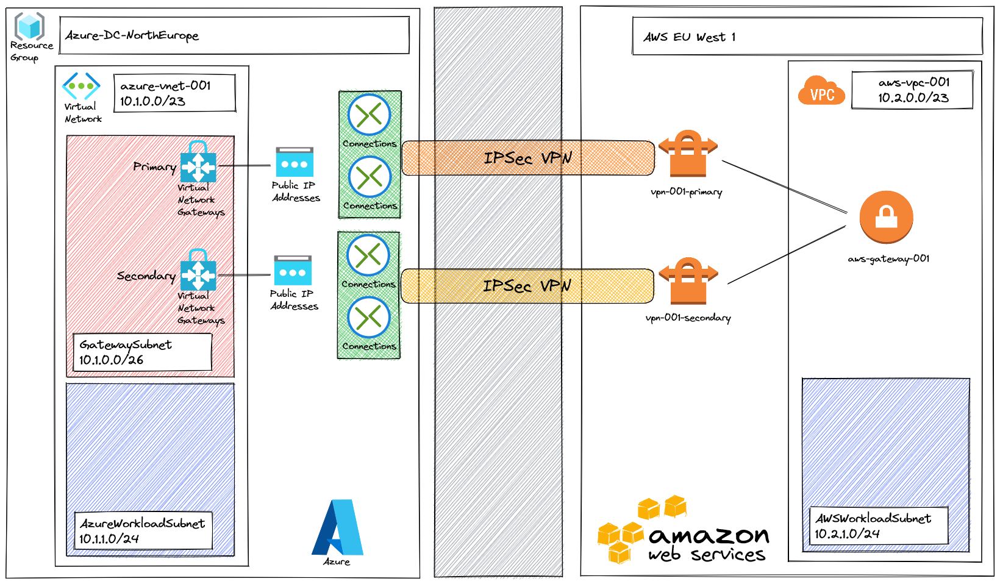

# Terraform Azure - AWS VPN & BGP

## Overview
This project provide some Terraform files to deploy a full VPN connectivity with Azure and AWS and to configure BGP to manage routing dynamicaly.

# High Level Design
- Azure North Europe :
  - VNet: 10.1.0.0/23
  - BGP ASN: 65515 
- AWS EU West 1:
  - VPC: 10.2.0.0/23
  - BGP ASN: 64512 



# Implementation

## Requirements
You will need to install : 
* [Terraform](https://www.terraform.io/downloads.html) (tested with version v1.1.x)
* Terraform Provider (installed using command *terraform init*): 
  * azurerm (3.1.0)
  * aws (4.9.0)

## Quickstart
The infrastructure will be implemented as described in the high level design but can be customized according to your needs.
````
> terraform init
> terraform plan
> terraform apply
````